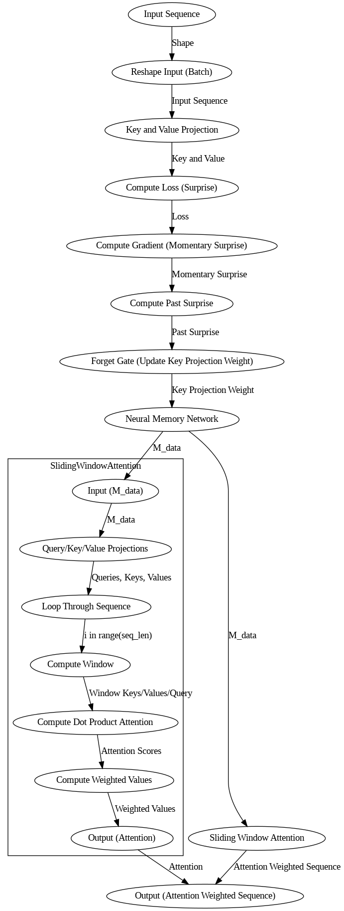

## UPDATE:
Transformers got limits, esp. on long reads. They just choke sometimes. One technique, linear attention's a speed hack for attention mechs: kernel trick + recurrence. Faster, less memory, handles longer sequences. Tradeoff? Maybe accuracy dips. Worth it?

Nah, standard softmax attention scales quadratically, right? N-squared complexity kills you for long sequences. Linear attention flips the script, hits you with O(N). Accumulators are the key, fam. Also linear attention enhances Transformer scalability for longer sequences, though optimal performance on specific tasks may necessitate synergistic integration with techniques like sparse attention. Efficient, but additive writes make it prone to memory overflows, which is, like, a real bummer. 
 

# As we promised before, we will deliver the <b>meta-like neural</b>
 

When we use this method and run it using the llama 3.3 70B instruct, this model features enhanced memory and storage modalities <b>and also after we test on hard LeetCode tasks and engineering tasks, this method is very very very fucking good for test-time compute scaling for long memory</b> (Hypothesis: Integrating this method could yield a computationally lean, yet ferociously performant model. You have to try on Qwen Coder. We feel enough to use this 3.3 70B model, it more straight and we can feel if this model can do 'reasoning' like eventhough it doesn't do it at all).
 
 

REMEMBER!!!
IT'S NOT ABOUT ACCURACY, IT'S ABOUT CONTEXT!!
 
 
 
 
 
# Again, as we promise, we will deliver the <b>meta-like neural</b>

Engage with the code, use it in your own agent. Opensource is a real fight 
<b>Go ahead, 'innovate' on this. If you got the IQ for it. Cause we're idiot people :)</b> 
<b>Hack it? If you're some kinda genius, be my guest.</b>
 
 
 

Special Credits for my fellas -> Herman, Wanto, Bun Yen Tao, Google <b>(Of Course)</b>
 
 
 
 
 
 
 
 
 
 
 
 
 
 
 
 
 
 
 
 
 
 
 
 
 
 
 
 
 
 
 
 
 
 
 
 
 
 
 
 
 
 
 
 
 
 
 
 
 
 
 
 
 
 
 

Hypothesis: This model's got bakwan-frying potential.
